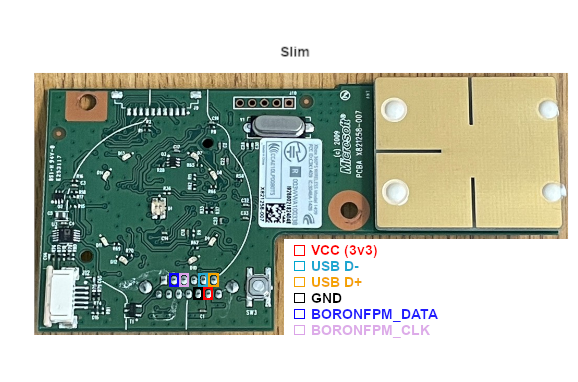

# Wiring — RP2040-Zero ↔ Xbox 360 S (Boron) FPM

## Principle

The Front Panel Module is a self-contained USB device. Its **USB lines go
straight to the PC** and never touch the RP2040. The RP2040 only drives the
FPM's 2-wire control bus (power LED + controller binding) and reads a sync
button.

## Physical connector layout

As seen on the board — **`■` is the square pad = pin 1** (the pin-1 marker).
Top row 1–6, bottom row 13→7:

```
   ■1    2    3    4    5    6
   13   12   11   10    9    8    7
```

The six wires you actually connect:

```
   pin  signal        connect to
   ---  ------------  ----------------------------
    8   FP_PWR        RP2040 3V3    ⚠ THIS is the 3.3V pin — the module's MAIN
                                     power rail. NOT pin 12 (see warning below).
    9   GND1          RP2040 GND / common ground
    2   C_DATA        RP2040 GP3    (+1k pull-up to 3V3)
    3   C_CLK         RP2040 GP4    (+1k pull-up to 3V3)
    6   D+            PC USB D+ (green)
    5   D−            PC USB D− (white)
   (every other pin — including pin 12 — leave unconnected)
```

> ### ⚠️ Power goes on pin 8, NOT pin 12
> This is the single mistake that cost the entire bring-up. The X819886
> schematic labels **pin 12 = `V_3P3STBY`** (3.3V **standby**) and **pin 8 =
> `FP_PWR`** — but standby power only feeds a tiny always-on domain (enough for
> button sense and a mushy ~2.0V on the bus), **not** the SC14470's main logic.
> Powering pin 12 leaves the chip half-alive: it never clocks, never enumerates
> over USB, and the control bus reads ~2.0V. **Feed 3.3V to pin 8 (FP_PWR) —
> the main rail — and the module comes fully alive.** Verify by measuring
> **pin 8 → GND ≈ 3.3V** at the module.

### Reference: drtrinity's Boron → Pico tap points

The same signals can be tapped from the on-board pad row (between the ribbon
connector and the sync button). This annotated photo maps them by colour:



> red = VCC (3.3V), black = GND, dark-blue = BORONFPM_DATA, pink =
> BORONFPM_CLK, cyan = USB D−, orange = USB D+.
>
> Image credit: **drtrinity**, *"Reversing the Xbox 360 Front Power Module:
> The SMC Two-Wire Interface"* —
> <https://drtrinity.uk/blog/2025/05/12/reversing-the-rf-board-1>

## Boron FPM connector pinout (X819886-001)

From the official BORON CONN schematic. We use only 6 of the 17 pins.

| Pin | Signal | Direction | Use here |
|----:|--------|-----------|----------|
| 1 | FP_TEMP_P | temp sensor | skip |
| **2** | **C_DATA** | control-bus data (BI) | → RP2040 `GP3` (+10k pull-up) |
| **3** | **C_CLK** | control-bus clock (FPM drives) | → RP2040 `GP4` (+10k pull-up) |
| 4 | SPARE1 | — | skip |
| **5** | **D−** | USB differential | → USB to PC |
| **6** | **D+** | USB differential | → USB to PC |
| 7 | FP_TEMP_N | temp sensor | skip |
| **8** | **FP_PWR** | **main 3.3V power** | ← RP2040-Zero `3V3` pad |
| **9** | **GND1** | ground | → GND |
| 10 | ODD_EJECT | eject button out | skip |
| **11** | **GND2** | ground | → GND |
| 12 | V_3P3STBY | 3.3V **standby** (does NOT power the logic) | **skip** — see warning above |
| 13 | BINDSW_N | bind button out | skip (we sync over the bus) |
| 14 | ME1 | mount / GND | GND (optional) |
| 15 | ME2 | mount / GND | GND (optional) |
| 16 | ME3 | mount / GND | GND (optional) |
| 17 | ME4 | mount / GND | GND (optional) |

Note from schematic: `BORONFPMPORT_DX IS A USB DIFFERENTIAL PAIR` (pins 5/6).

## Connections

| RP2040-Zero | ↔ | FPM pin | Notes |
|-------------|---|---------|-------|
| `5V` pad    | ← | USB VBUS (5V, from the PC cable) | powers the Zero; 5V as **INPUT** |
| `3V3` pad   | → | **8** FP_PWR (main 3.3V — NOT pin 12) | Zero's regulator powers the FPM |
| `GND`       | ↔ | **9 / 11** (+ ME1–4) | common ground |
| `GP3`       | ↔ | **2** C_DATA | + 10kΩ pull-up to 3V3 |
| `GP4`       | ← | **3** C_CLK | + 10kΩ pull-up to 3V3 (FPM drives it) |
| `GP2`       | ← | sync button → GND | internal pull-up in firmware |

### USB routing

The PC's USB cable: **D+ → FPM pin 6, D− → FPM pin 5, GND → pin 9/11**, and
its **5V → the Zero's `5V` pad** (the FPM itself runs on 3.3V from the Zero,
not on USB 5V).

### Pull-ups and decoupling

- The console provides 100kΩ pull-ups on the bus lines *from the motherboard*.
  A salvaged FPM has none, so add **1–10kΩ pull-ups on C_DATA and C_CLK to 3V3**.
- A ~10–100 µF cap across the module's 3.3V (pin 8) / GND near the connector is
  good practice for clean power.

## USB / power rules

- **One 5V source at a time.** Power the Zero from the PC cable's 5V (into the
  `5V` pad). Do **not** also plug the Zero's USB-C into a PC simultaneously —
  the Zero may lack backfeed protection and the rails would fight.
- Use the Zero's **USB-C only for flashing firmware**, module unplugged.

## Before powering on

1. Confirm silkscreen: `3V3` on the Zero is the regulator **output**; feed it
   to FPM **pin 8** (FP_PWR), **not** pin 12. Never put 5V on it.
2. Double-check pins 5/6 (D−/D+) and 2/3 (C_DATA/C_CLK) against your actual
   board with a multimeter — pin numbering/orientation on a bare connector is
   easy to mirror.
3. Verify FPM current draw fits the Zero's LDO headroom (low-power; fine).
